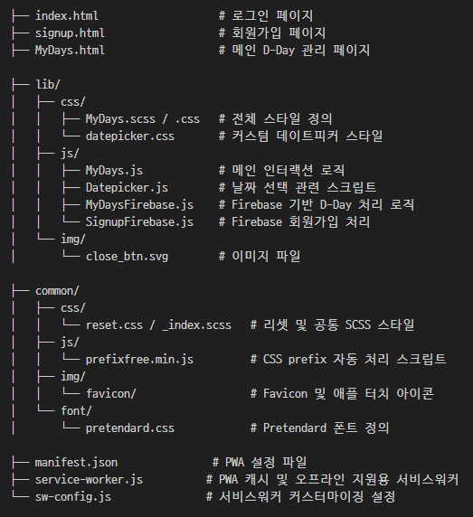
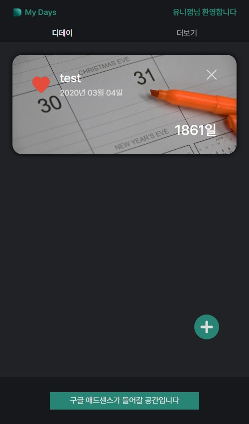
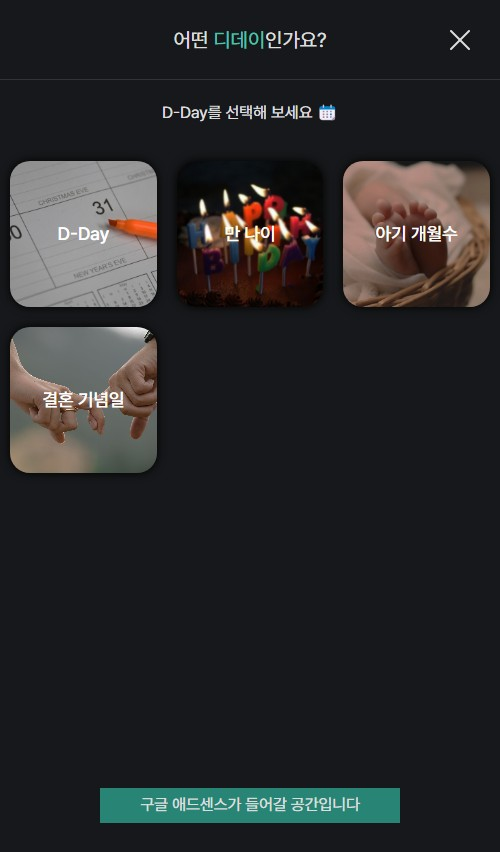
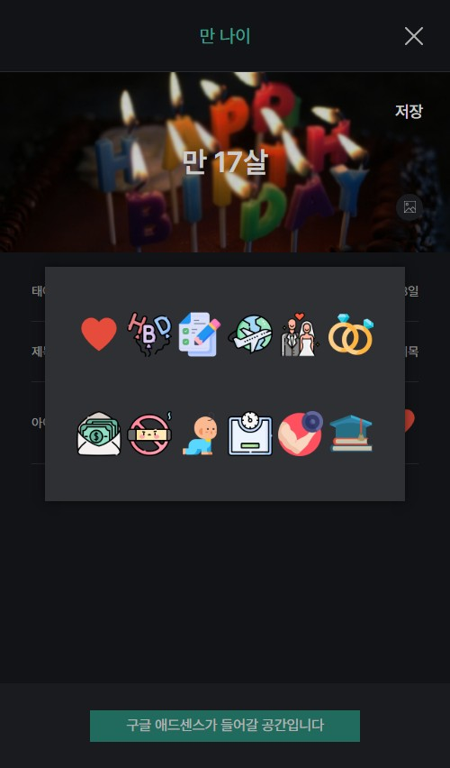
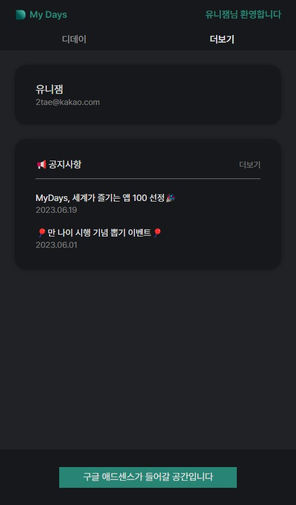
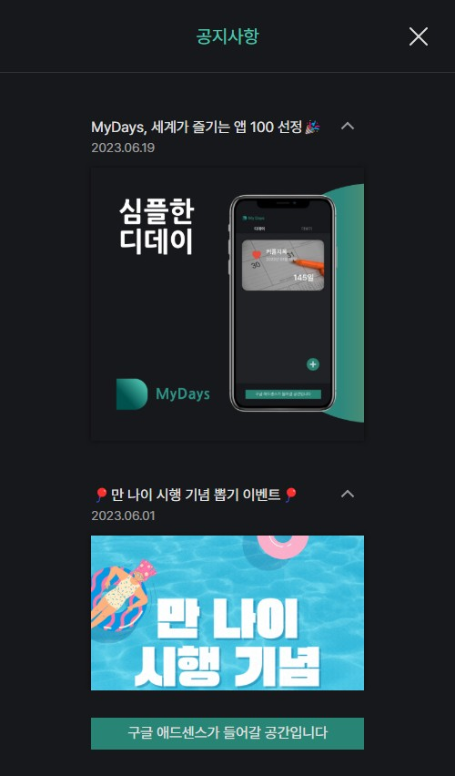
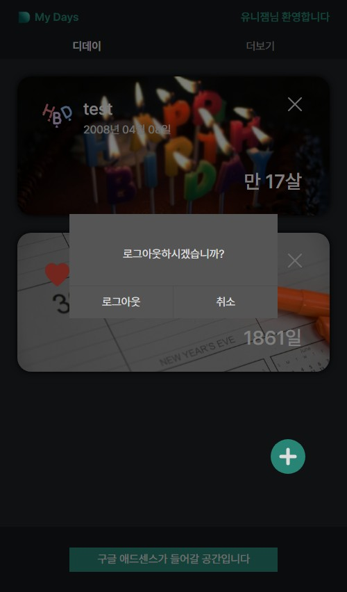
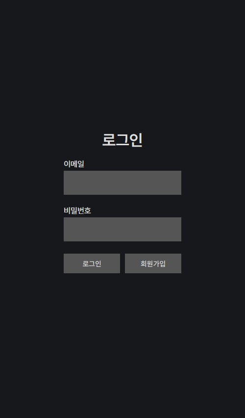
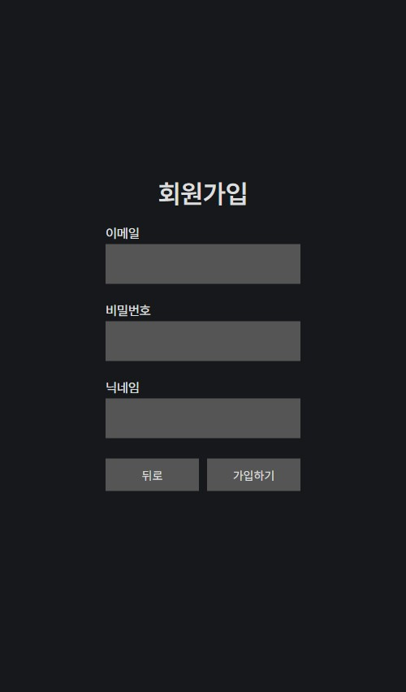

# MyDays - 감성 D-Day 관리 웹앱

MyDays는 Firebase를 기반으로 한 **감성 D-Day 관리 및 기록 웹 애플리케이션**입니다.  
디데이 생성, 아이콘 및 커버 이미지 커스터마이징, 공지 확인, 날짜 선택, 회원가입 및 로그인 등 다양한 기능을 제공합니다.  
미니멀하고 다크한 UI를 중심으로 감성적인 사용자 경험을 설계했습니다.

---

## 📌 주요 기능 및 구현

### 💡 공통 기능
- Firebase 기반 로그인 / 회원가입 / 로그아웃 기능 구현
- 디데이(D-Day) 등록, 수정, 삭제 기능 제공
- 다양한 아이콘 선택 및 배경 이미지 업로드 기능
- 페이지 내 슬라이드 전환 (Swiper.js 활용)
- 선택형 날짜 피커(Datepicker.js) 구현
- 공지사항 조회 기능 및 상세 페이지 구현
- PWA 지원을 위한 service-worker.js 구성

---

## 📂 폴더 및 파일 구조

---

## 🛠 사용 기술 스택

- **HTML5 / SCSS / JavaScript (Vanilla JS)**
- **Firebase**: 회원가입, 로그인, DB 연동
- **Swiper.js**: 슬라이드 기반 뷰 구성
- **Custom Datepicker.js**: 커스터마이징된 날짜 선택기
- **Service Worker**: PWA 기능 지원
- **Pretendard 폰트, CSS 리셋**

---

## ✅ 구현 포인트

- **디데이 정보 시각화**: 아이콘 + 타이틀 + 날짜 차이 표시
- **풀스크린 탭형 페이지 전환 구조**
- **이미지 및 아이콘 선택 UX 최적화**
- **공통 레이아웃 구조 재사용화**
- **반응형 모바일 중심 디자인**
- **CSS 기반 미니멀 감성 테마 구현**
- **공지사항 상세 페이지 트랜지션 구현**

---

## 📎 참고

- 본 프로젝트는 개인 포트폴리오 용도로 제작된 **자체 기획 웹앱**입니다.
- Firebase 연동이 필요하므로 직접 배포 시에는 API 키 및 설정이 필요합니다.

---

## 📷 미리보기

