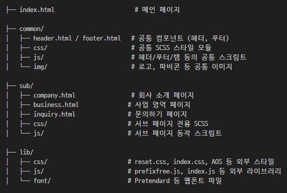
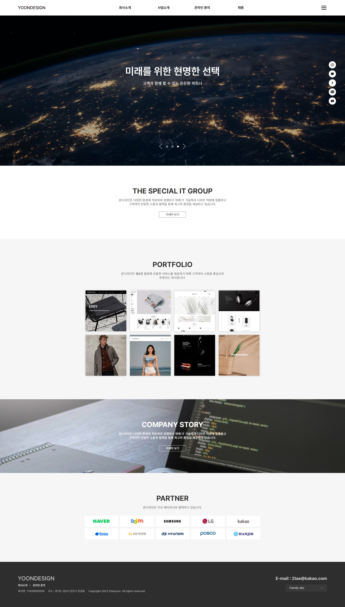
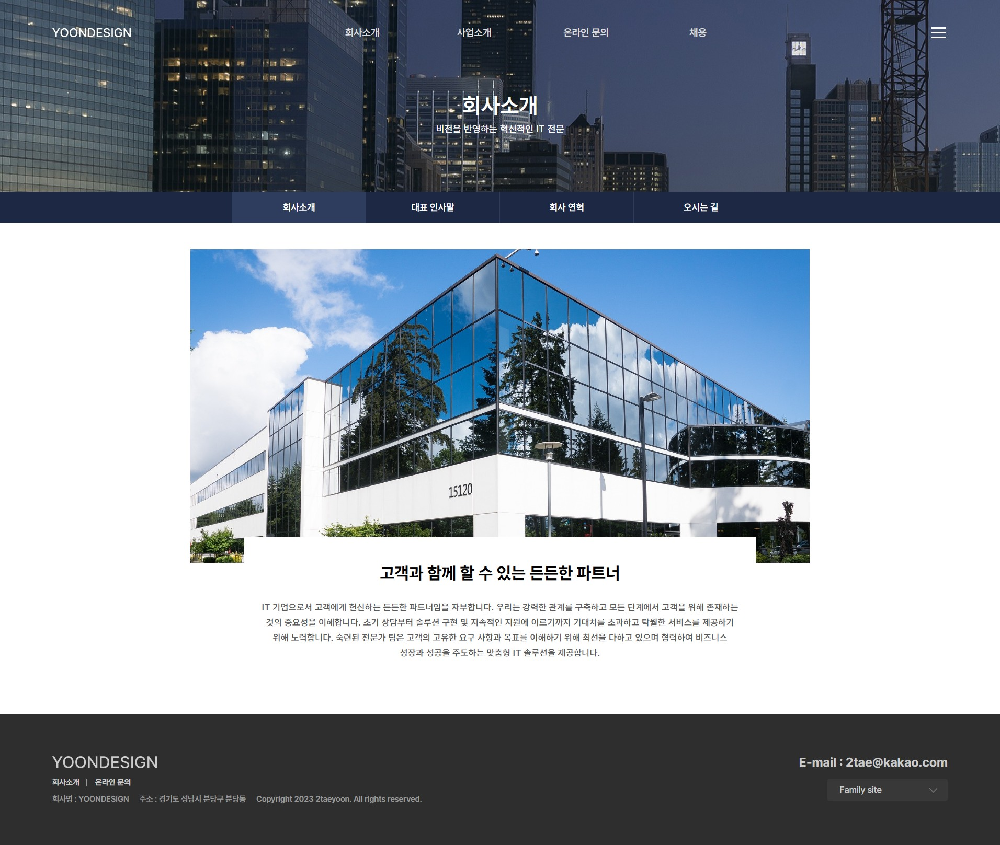
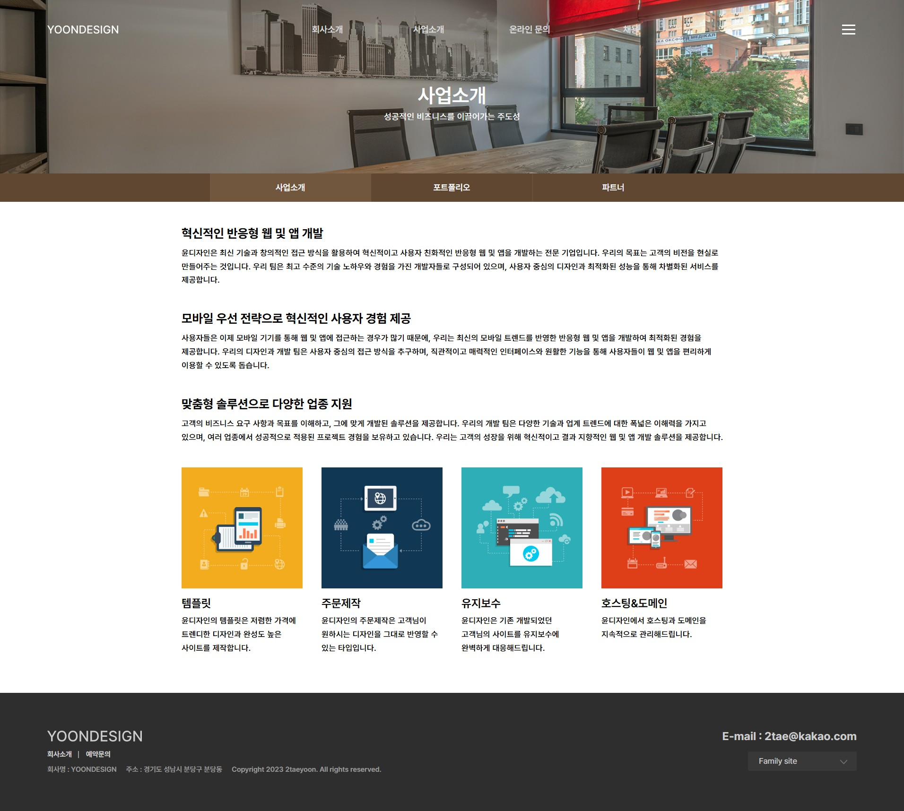
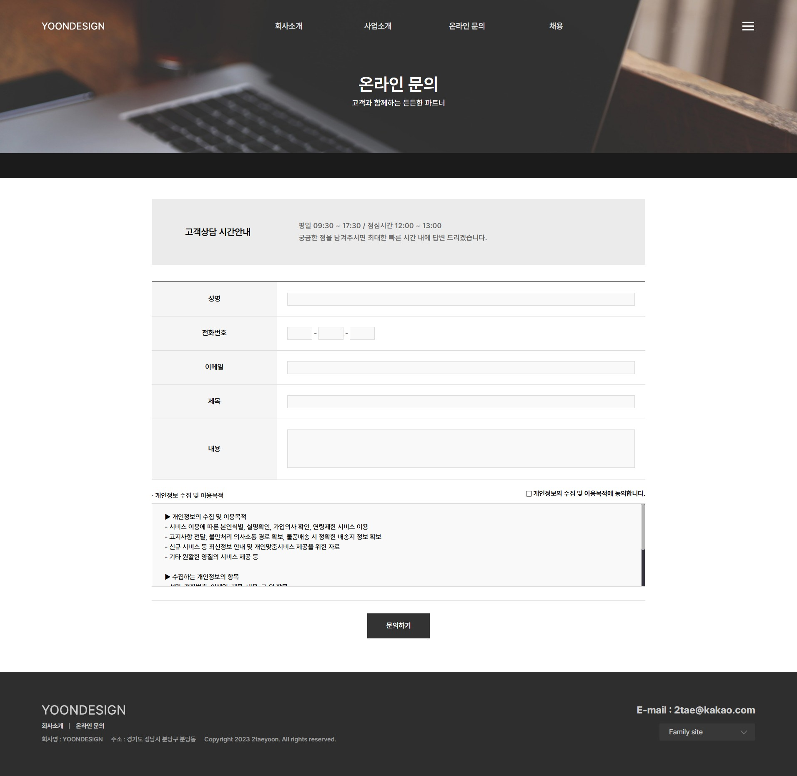

# YOONDESIGN 기업 사이트

YOONDESIGN은 기업의 비전을 시각적으로 전달하는 **반응형 웹사이트 프로젝트**입니다.  
HTML, SCSS, JavaScript 기반으로 개발되었으며, 브랜드 아이덴티티를 강화하는 **메인 슬라이더, AOS 스크롤 애니메이션, 햄버거 메뉴, 탭 콘텐츠 전환** 등의 기능이 포함되어 있습니다.

---

## 📌 주요 기능 및 구현

### 💡 공통 사항
- **전체 반응형 웹 구현**: PC / 모바일 해상도에 따른 미디어 쿼리 기반 설계
- **슬라이더 구현**: 메인 배너 영역에 커스텀 슬라이드 적용
- **스크롤 애니메이션**: AOS.js 라이브러리 적용으로 부드러운 콘텐츠 등장 효과
- **동적 헤더 UI 전환**: 스크롤 위치에 따라 헤더 스타일 자동 변경
- **햄버거 메뉴**: 모바일 환경 대응 사이드 내비게이션 슬라이드
- **탭 전환 콘텐츠**: `.sub_nav` 클릭 시 `.sub_content` 전환

---

## 📂 폴더 및 파일 구성

---

## 🛠 사용 기술 스택

- **HTML5 / SCSS / JavaScript**
- **AOS.js**: 스크롤 애니메이션 처리
- **Vanilla JS** 기반 UI 트랜지션 (슬라이더, 햄버거, 탭 등)
- **미디어쿼리 기반 반응형 설계**
- **prefixfree.js**: 벤더 프리픽스 자동 처리

---

## ✅ 구현 포인트

- **정적인 마크업 기반의 동적 UX 구현**  
- 모바일 / PC 환경을 모두 고려한 유연한 구조
- AOS와 커스텀 JS로 부드러운 애니메이션 UX 적용
- **Semantic HTML과 BEM 스타일 SCSS 구조화**
- 탭 인터랙션 및 섹션별 콘텐츠 관리 구조 적용

---

## 📷 미리보기

  
  
  
	

---

## 📎 기타

- 본 프로젝트는 실제 기업 사이트와 무관한 개인 포트폴리오 목적의 사이트입니다.