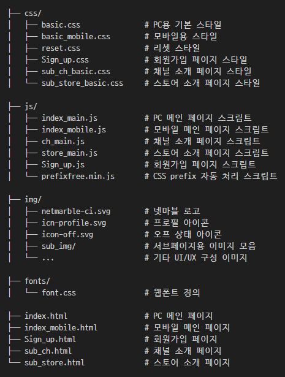
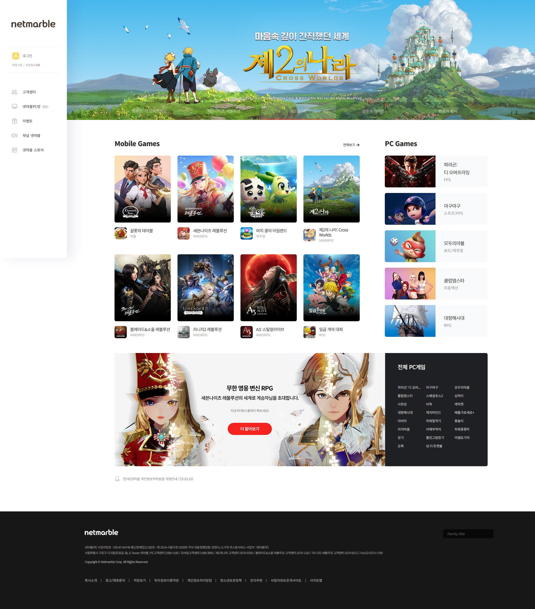
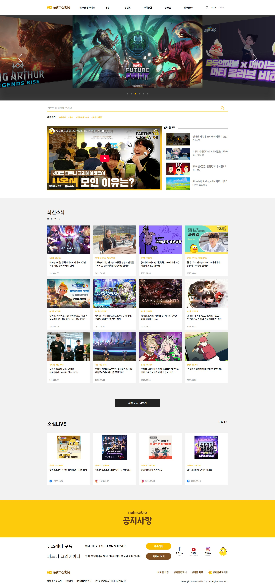
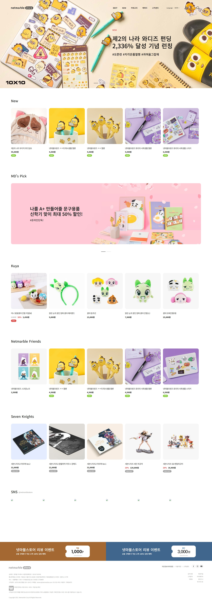
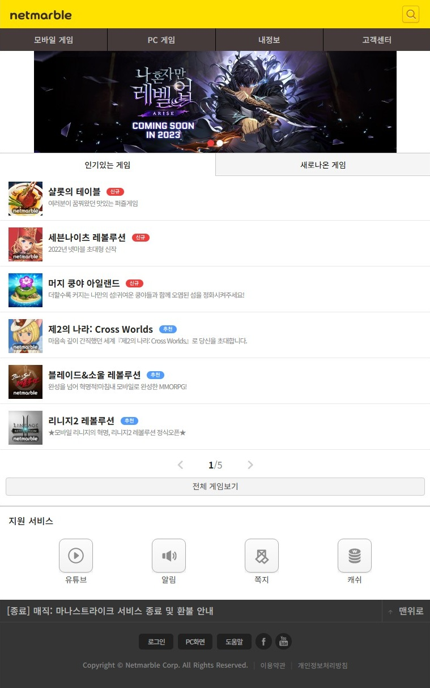
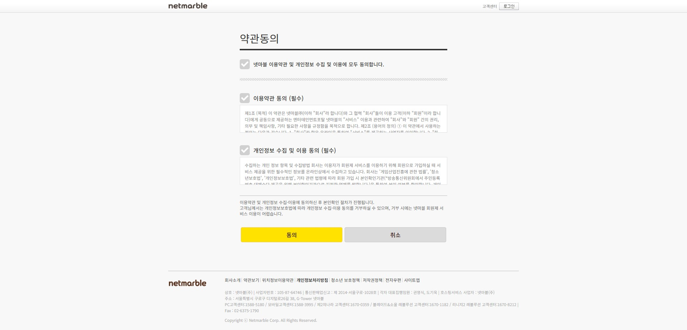

# Netmarble Clone Website

넷마블 공식 웹사이트를 클론한 반응형 웹 프로젝트입니다.  
HTML, CSS, JavaScript 기반으로 제작되었으며, PC 및 모바일 대응을 위한 **레이아웃 분기 처리**, **Swiper 슬라이더**, **탭 인터랙션**, **이미지 오버레이** 등 다양한 UI 요소가 포함되어 있습니다.

---

## 📌 주요 기능 및 구현

### 💡 공통 사항
- 전체 반응형 설계 (PC / Mobile 전용 HTML 분리: `index.html`, `index_mobile.html`)
- Swiper 기반 슬라이드 구성 (메인 배너, 모바일 슬라이더 등)
- 탭 메뉴 및 슬라이더 내 동적 콘텐츠 렌더링
- 콘텐츠 카드 hover 인터랙션
- 접근성 고려한 구조 (텍스트 대체, 라벨링 등)

---

### 📂 폴더 및 파일 구성

---

## 🛠 사용 기술 스택

- **HTML5 / CSS3 / JavaScript**
- **Swiper.js**: 슬라이더 구성
- **Vanilla JS**로 탭, 인터랙션, 토글 처리
- **미디어 쿼리 기반 반응형 대응**
- **CSS 애니메이션, hover 효과 다수 적용**

---

## ✅ 구현 포인트

- **PC와 Mobile을 구분한 완전한 구조**
- 다양한 콘텐츠 UI 컴포넌트 구성: 슬라이더, 탭, 콘텐츠 카드, 뉴스 리스트
- **접근성과 사용자 흐름을 고려한 UI 배치**
- 실제 넷마블 페이지와 유사한 **비주얼 & 인터랙션 디자인 구현**

---

## 📎 참고

본 프로젝트는 학습 목적으로 제작된 클론코딩이며, 실제 Netmarble 사이트와 무관합니다.

---

## 📷 미리보기

